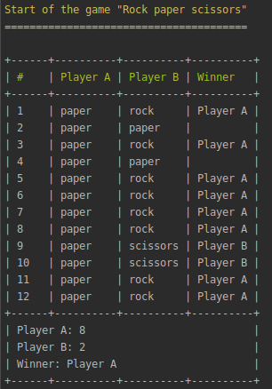

# “Rock, Paper, Scissors” Game
Rock, Paper, Scissors (aka "Ro-Sham-Bo"; janken; "Bato, Bato, Pick"; and "Scissors, Paper, Stone") is a simple hand game.

Each time Player A and Player B “throw” their selection. The first one always throws “Paper”, the second throws a random shape. If both players throw the same object, it’s a draw. If not, it’s decided by the next principle:
- Rock crushes Scissors;
- Scissors cuts Paper;
- Paper covers Rock.

## Supported Platforms

* Windows
* iOS
* Linux

## System Requirements
* Docker

## 1 Running application

At first you need to run the application using the command
```
make start
```

### 1.1. Running Tests

Run the next command line for tests execution:
```
make test
```

### 1.2 Start Game and Analyze Result

To start the game all you need is to execute the next command:
```
make game-start
```

The results will look like:

